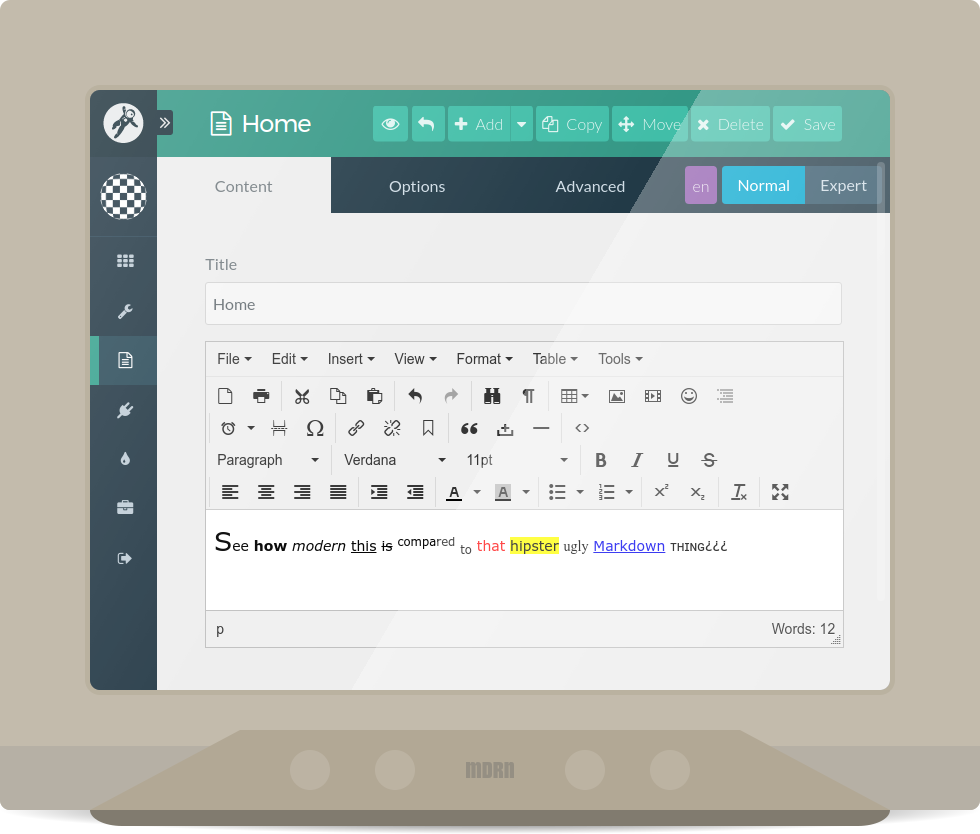

# TinyMCE Editor Integration
  
The **TinyMCE Editor Integration** is a state-of-the-art plugin, integrating the enterprise-grade [TinyMCE](https://www.tinymce.com/) WYSIWYG HTML Editor with the modern CMS [Grav](https://getgrav.org/) is.

Blabbing aside, this is the plugin that you should use when you're tired of, scared of, or otherwise not comfortable using Markdown to author your pages from within the [Grav Admin Plugin](https://github.com/getgrav/grav-plugin-admin). It's vastly configurable, so you should have no issues adapting it to your liking, and its default configuration has been made with consistency and ease of use in mind, significantly reducing the chance that you have to change anything at all.
## Installation
There are two methods of installing the TinyMCE Editor Integration plugin, each of them available with the use of the admin plugin or manually.
### Installation with the use of the Grav Package Manager
The simplest way to install this plugin is via the **Grav Package Manager (GPM)**. It can be used from within the admin plugin under **Plugins** > **Add**, or as a standalone executable accessible through your system's terminal (also called the command line).
>#### Installation with the use of the admin plugin (Recommended)
>In the admin plugin, go to **Plugins** > **Add** and enter the plugin's name there. When it is found, click the Install button next to it.
>#### Installation with the use of a terminal
>Run the following From the root of your Grav install:
>```
>bin/gpm install tinymce-editor
>```

Either of these will install the TinyMCE Editor Integration plugin into your `/user/plugins` directory within Grav. Its files can be found under `/user/plugins/tinymce-editor`.
### Manual installation
You may also decide that you want to install the plugin manually, which may prove very useful if you want to use the latest, unreleased features of the plugin.
>#### Manual installation with the use of the admin plugin
>In the admin plugin, go to **Tools**, and paste the following into the textbox under **Install a zip package from a remote location**:
>```
>https://github.com/newbthenewbd/grav-plugin-tinymce-editor/archive/develop.zip
>```
>#### Manual installation with the use of a file archiver
>[Download](https://github.com/newbthenewbd/grav-plugin-tinymce-editor/archive/develop.zip) the latest development version of the plugin and unzip it into your `/user/plugins/` directory within Grav, then rename the unzipped directory to `tinymce-editor`.

You should now have all the plugin files under `/user/plugins/tinymce-editor`.
## Configuration

Before configuring this plugin, you should copy the `/user/plugins/tinymce-editor/tinymce-editor.yaml` file to `/user/config/plugins` and only edit that copy.

This is the default configuration and an explanation of available options:
```yaml
enabled: true
apikey: '' # The API key to use with TinyMCE Cloud. If empty, local copy of TinyMCE will be used
plugins: # The plugins to load with TinyMCE
  - advlist
  - anchor
  - autoresize
  - charmap
  - code
  - colorpicker
  - emoticons
  - fullscreen
  - hr
  - image
  - insertdatetime
  - link
  - lists
  - media
  - nonbreaking
  - pagebreak
  - paste
  - print
  - searchreplace
  - table
  - textcolor
  - toc
  - visualchars
  - wordcount
parameters: # Additional parameters to pass to TinyMCE during its initialization
  -
    name: fontsize_formats
    value: '6pt 7pt 8pt 9pt 10pt 11pt 12pt 13pt 14pt 15pt 16pt 18pt 20pt 22pt 24pt 26pt 28pt 32pt 36pt 40pt 44pt 48pt 54pt 60pt 66pt 72pt 80pt 88pt 96pt'
  -
    name: paste_data_images
    value: '1'
menubar: true # If enabled, a menu bar will be present over the toolbar
menu: # The tree of the TinyMCE menu elements, ignored if menu bar is disabled
  -
    title: File
    items: 'newdocument print'
  -
    title: Edit
    items: 'undo redo | cut copy paste pastetext | selectall | searchreplace'
  -
    title: Insert
    items: 'media link image | pagebreak charmap anchor hr insertdatetime nonbreaking toc'
  -
    title: View
    items: 'visualchars visualaid | fullscreen'
  -
    title: Format
    items: 'bold italic underline strikethrough superscript subscript | formats | removeformat'
  -
    title: Table
    items: 'inserttable tableprops deletetable | cell row column'
  -
    title: Tools
    items: code
toolbar: # The toolbar layout for TinyMCE to use
  -
    row: 'newdocument print | cut copy paste | undo redo | searchreplace visualchars | table image media emoticons toc | insertdatetime pagebreak charmap | link unlink anchor | blockquote nonbreaking hr | code'
  -
    row: 'formatselect | fontselect fontsizeselect | bold italic underline strikethrough | alignleft aligncenter alignright alignjustify | indent outdent | forecolor backcolor | bullist numlist | superscript subscript | removeformat | fullscreen'
branding: false # If enabled, a "Powered by TinyMCE" branding will be present at the bottom of the editor
statusbar: true # If enabled, a status bar will be present at the bottom of the editor
```
When more customization is desired than the above options allow, you may create a directory called `tinymce-editor` in `/user/data`, and copy a subset of `/user/plugins/tinymce-editor` in there. The changes to the contents of that directory will be reflected in the plugin's behavior, and they will not be affected by updates. Currently supported subsets are the directories `blueprints`, `css`, `js/tinymce` and `templates`, and their entire contents should, when needed, be copied to `/user/data/tinymce-editor/blueprints`, `/user/data/tinymce-editor/css`, `/user/data/tinymce-editor/js/tinymce` and `/user/data/tinymce-editor/templates`, respectively.
## Usage
**NOTE:** It is recommended to disable the Markdown parser in `/user/config/system.yaml` or under **Configuration** > **System** in the admin plugin to lower the resource usage once this plugin has been installed.

The plugin itself is ready to be used out of the box, set up with a sensible default configuration. It will replace all the Markdown page editor fields in the admin plugin with TinyMCE.
## Credits
Many thanks to everyone involved in the creation of [TinyMCE](https://github.com/tinymce/tinymce), the only FOSS HTML WYSIWYG editor that can actually do just what is expected of it with a little configuration. It is located under `/tinymce-editor/js/tinymce`, with all the languages available for it at the time of the latest integration plugin release installed under `/tinymce-editor/js/tinymce/langs`.

Huge thanks to the [Grav Slack Chat community](https://getgrav.org/slack) for providing help with Grav whenever possible, and to those involved in the creation of Grav, a CMS with an actually beautiful architecture.

Thanks to those the plugin was originally made for – my family with their websites – and to those others who may now use it as well.

Last but not least, ~free tanks~ many thanks to [the very important person hiding behind this noble nickname on GitHub](https://github.com/Buttpants) for ~keeping sanity~ staying understanding while I've been unresponsive ~wasting a huge amount of time~ creating this plugin.
## To Do
- [ ] Add more translations to languages.yaml
- [x] ???
- [x] That's it!

## ~Nagging for~ Donations
> **Do you perhaps feel awesome,  
> and happen to sleep on mone?  
> Drop some, feel more awesome!**\*

[](https://www.paypal.com/cgi-bin/webscr?cmd=_donations&business=sendmoney%40go2%2epl&lc=US&item_name=Donate%20to%20the%20GitHub%20user%20newbthenewbd&currency_code=USD&bn=PP%2dDonationsBF%3abtn_donateCC_LG%2egif%3aNonHosted)

*No, really, there are no perks associated with donating aside from the increased self-awesomeness, though our self-awesomeness will be increased too!
## Random Disclaimers
"TINYMCE" is a registered trademark and brand of Moxiecode Systems AB.
